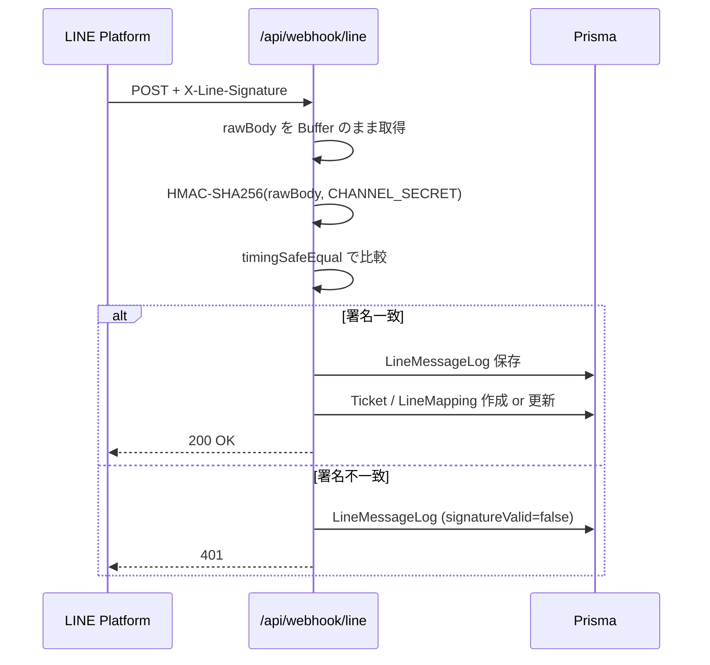

# API — リカーショップゴワ LINE問い合わせ進捗管理プラットフォーム API仕様

> 対象: 開発者 / 統合エンジニア
> ベースURL: `https://your-domain.vercel.app` （ローカルは `http://localhost:3000`）
> 認証: NextAuth セッション Cookie（内部API） / X-Line-Signature（Webhook）

---

## 1. API一覧表

### 1.1 認証

| Method | Path | 認証 | 用途 | Phase |
|---|---|---|---|---|
| GET/POST | `/api/auth/[...nextauth]` | - | NextAuth ハンドラ（OAuth/Demo Credentials） | 1.0 |

### 1.2 Webhook（外部 → 本サーバ）

| Method | Path | 認証 | 用途 | Phase |
|---|---|---|---|---|
| POST | `/api/webhook/line` | X-Line-Signature | LINE Messaging API 受信 | 1.0 |
| POST | `/api/webhook/gchat` | （Phase 1.5: 共有秘密） | Google Chat スラッシュコマンド受信 | 1.5 |

### 1.3 メッセージ送信

| Method | Path | 認証 | 用途 | Phase |
|---|---|---|---|---|
| POST | `/api/messages/send` | Session（staff以上） | チケット内メッセージ送信（LINE Push / 内部メモ） | 1.0 |

### 1.4 チケット

| Method | Path | 認証 | 用途 | Phase |
|---|---|---|---|---|
| GET | `/api/tickets` | Session | 一覧取得（フィルタ可） | 1.0 |
| POST | `/api/tickets` | Session | 手動作成 | 1.0 |
| GET | `/api/tickets/{id}` | Session | 詳細取得 | 1.0 |
| PATCH | `/api/tickets/{id}` | Session | 更新（subject/category/priority） | 1.0 |
| PATCH | `/api/tickets/{id}/status` | Session | ステータス変更（FSM 検証） | 1.0 |
| PATCH | `/api/tickets/{id}/assignee` | Session | 担当者変更（handoverNote 必須） | 1.0 |
| POST | `/api/tickets/{id}/comments` | Session | コメント追加 | 1.0 |
| POST | `/api/tickets/{id}/lost` | Session | 失注理由登録 | 1.0 |

### 1.5 マッピング

| Method | Path | 認証 | 用途 | Phase |
|---|---|---|---|---|
| GET | `/api/mappings` | Session | マッピング一覧 | 1.0 |
| GET | `/api/mappings/unmapped` | Session | 未紐付けキュー | 1.0 |
| POST | `/api/mappings/{lineUserId}/link` | Session | 紐付け確定 | 1.0 |
| POST | `/api/mappings/{lineUserId}/unlink` | Session | 紐付け解除 | 1.0 |
| GET | `/api/mappings/{lineUserId}/candidates` | Session | AI候補再計算 | 1.0 |

### 1.6 ヘルスチェック

| Method | Path | 認証 | 用途 |
|---|---|---|---|
| GET | `/api/health` | - | 死活監視 |

---

## 2. 認証

### 2.1 NextAuth セッション

ブラウザクライアントは Cookie で認証されます。Server Component / Route Handler では `auth()` で session 取得:

```typescript
import { auth } from "@/lib/auth";
const session = await auth();
if (!session) return new Response("Unauthorized", { status: 401 });
const userId = session.user!.id;
const role = (session.user as any).role;  // "kowa" | "manager" | "staff_office" | "staff_field" | "finance"
```

### 2.2 デモ Credentials

`DEMO_MODE=true` の時のみ。

```bash
curl -X POST http://localhost:3000/api/auth/callback/demo \
  -H "Content-Type: application/x-www-form-urlencoded" \
  --data-urlencode "role=kowa" \
  --data-urlencode "csrfToken=<取得した csrfToken>"
```

通常は UI から「**他のロールで試す**」を使用するため、cURL で叩くケースは稀。

---

## 3. Webhook 詳細

### 3.1 POST /api/webhook/line

LINE Messaging API からの Webhook 受け口。

#### リクエストヘッダ

| ヘッダ | 必須 | 内容 |
|---|---|---|
| `Content-Type` | ✅ | `application/json` |
| `X-Line-Signature` | ✅ | HMAC-SHA256 署名（Base64） |
| `User-Agent` | - | `LineBotWebhook/2.0` |

#### リクエストボディ（例: テキストメッセージ）

```json
{
  "destination": "U1234567890abcdef1234567890abcdef",
  "events": [
    {
      "type": "message",
      "webhookEventId": "01H...",
      "deliveryContext": { "isRedelivery": false },
      "timestamp": 1715251200000,
      "source": {
        "type": "user",
        "userId": "U0123456789abcdef0123456789abcdef"
      },
      "replyToken": "abcd1234efgh5678",
      "mode": "active",
      "message": {
        "id": "501234567890",
        "type": "text",
        "text": "明日の納品を10時に変更お願いします"
      }
    }
  ]
}
```

#### レスポンス

| ステータス | 内容 |
|---|---|
| 200 OK | 受領成功（処理は非同期） |
| 401 Unauthorized | 署名検証失敗 |
| 400 Bad Request | パース不可（リトライ抑止のため 200 を返す運用も検討） |

```json
{ "ok": true }
```

#### 署名検証フロー



#### 内部処理

1. `LineMessageLog` レコード作成（`webhookEventId` で重複チェック）
2. event.type ごとに分岐:
   - `message` → メッセージ正規化 → Ticket 作成 or 既存統合
   - `follow` → LineMapping upsert（status=unverified）
   - `unfollow` → LineMapping を `failed` に
   - `postback` → 該当 Ticket にコメント追加
3. 未紐付けなら `LineMapping` を `unverified` で upsert + AI候補スコアリング
4. Google Chat に新規通知（任意）

### 3.2 POST /api/webhook/gchat

Google Chat スラッシュコマンドの受け口（Phase 1.5）。

#### リクエストボディ（Google Chat 仕様）

```json
{
  "type": "MESSAGE",
  "message": {
    "text": "/ticket TKT-0042 担当変更 @yamada",
    "sender": { "name": "users/123456789", "displayName": "後和 直樹" },
    "thread": { "name": "spaces/AAAA/threads/BBBB" }
  },
  "space": { "name": "spaces/AAAA" }
}
```

#### レスポンス

```json
{
  "text": "TKT-0042 の担当を山田さんに変更しました",
  "thread": { "name": "spaces/AAAA/threads/BBBB" }
}
```

> **Warning**: Phase 1.5 実装時は **共有秘密（shared secret）** で送信元検証を必ず実装。

---

## 4. メッセージ送信

### 4.1 POST /api/messages/send

チケット内のメッセージ送信。LINE Push の場合は実際に送信、内部メモの場合は DB 保存のみ。

#### リクエスト

```json
{
  "ticketId": "ckxxxxx...",
  "channel": "line" | "internal",
  "content": "明日10時に納品いたします",
  "contentType": "text"
}
```

#### レスポンス（200）

```json
{
  "id": "ckmsg...",
  "ticketId": "ckxxxxx...",
  "direction": "outbound",
  "channel": "line",
  "content": "明日10時に納品いたします",
  "sentAt": "2026-05-09T14:32:00.000Z"
}
```

#### エラー

| ステータス | 条件 |
|---|---|
| 401 | 未認証 |
| 403 | 自分担当でないチケット（staff_field の場合） |
| 404 | チケット not found |
| 422 | content が空 / 500字超 |
| 502 | LINE API 5xx |

#### LINE Push 実装フロー

1. Ticket から `lineUserId` を取得
2. LineMapping が `linked` か検証（誤送信防止）
3. `@line/bot-sdk` の `client.pushMessage(lineUserId, { type: "text", text: content })`
4. レスポンス成功なら `Message` 作成 + Ticket の `last_message_at` 更新
5. 失敗時は再試行 / DLQ（Phase 2.0）

---

## 5. チケットAPI

### 5.1 GET /api/tickets

#### クエリパラメータ

| パラメータ | 型 | 説明 |
|---|---|---|
| `status` | string | カンマ区切り（`open,triaging`） |
| `kind` | string | `inbound` / `outbound` |
| `channel` | string | `official_line` / `email` / `phone` / `manual` / `gchat` |
| `assigneeId` | string | 担当者ID |
| `customerId` | string | 顧客ID |
| `isUnmapped` | boolean | 未紐付けのみ |
| `q` | string | 全文検索（subject + preview） |
| `limit` | number | 既定 50, 最大 200 |
| `offset` | number | ページング用 |

#### レスポンス（200）

```json
{
  "items": [
    {
      "id": "ckxxx",
      "publicId": "TKT-0042",
      "ticketType": "single",
      "kind": "inbound",
      "channel": "official_line",
      "category": "delivery",
      "status": "triaging",
      "priority": "high",
      "subject": "明日納品時刻変更",
      "preview": "10時に変更お願いします",
      "customer": { "id": "...", "code": "CUST-0123", "name": "居酒屋ABC" },
      "lineUserId": "U0123...",
      "isUnmapped": false,
      "assignee": { "id": "...", "name": "山田太郎", "image": "..." },
      "dueAt": "2026-05-10T01:00:00Z",
      "createdAt": "2026-05-09T05:32:00Z",
      "updatedAt": "2026-05-09T05:35:00Z"
    }
  ],
  "total": 42,
  "limit": 50,
  "offset": 0
}
```

### 5.2 POST /api/tickets

```json
{
  "subject": "電話受付：黒霧島1ケース注文",
  "preview": "黒霧島1ケース、明日納品希望",
  "category": "order",
  "kind": "inbound",
  "channel": "phone",
  "customerId": "ckcustxxx",
  "priority": "normal",
  "assigneeId": "ckusrxxx"
}
```

### 5.3 PATCH /api/tickets/{id}/status

#### リクエスト

```json
{
  "status": "answered",
  "comment": "顧客に在庫ありと回答"
}
```

#### FSM 検証エラー（422）

```json
{
  "error": "Invalid status transition",
  "code": "FSM_INVALID_TRANSITION",
  "details": { "from": "open", "to": "closed_won", "allowed": ["triaging", "escalated"] }
}
```

### 5.4 PATCH /api/tickets/{id}/assignee

#### リクエスト

```json
{
  "assigneeId": "ckusrxxx",
  "handoverNote": "顧客から黒霧島1ケース、明日10時納品希望と連絡。在庫確認済（5ケース）。配送指示お願いします。"
}
```

> **Warning**: `handoverNote` は **必須**（属人化防止）。500字以内。

### 5.5 POST /api/tickets/{id}/lost

```json
{
  "reason": "out_of_stock",
  "note": "黒霧島切れ、メーカー在庫も6月入荷予定"
}
```

---

## 6. マッピング API

### 6.1 GET /api/mappings/unmapped

#### レスポンス

```json
{
  "items": [
    {
      "lineUserId": "U0123456789abcdef0123456789abcdef",
      "displayName": "abc店長",
      "pictureUrl": "https://profile.line-scdn.net/...",
      "status": "unverified",
      "firstSeenAt": "2026-05-08T05:32:00Z",
      "lastSeenAt": "2026-05-09T03:11:00Z",
      "messageCount": 3,
      "recentPreview": "明日の発注お願いします",
      "candidates": [
        {
          "customerId": "ckcustxxx",
          "code": "CUST-0123",
          "name": "居酒屋ABC",
          "score": 0.85,
          "evidence": "displayName が屋号と前方一致 + 過去注文履歴一致"
        }
      ]
    }
  ],
  "total": 12
}
```

### 6.2 POST /api/mappings/{lineUserId}/link

#### リクエスト

```json
{
  "customerId": "ckcustxxx",
  "method": "ai_suggested_confirmed",
  "note": "AI候補1位を採用"
}
```

#### 処理フロー

1. `LineMapping` を取得
2. `customerId` セット、`status = "linked"`、`linkedById` `linkedAt` `linkedMethod` 更新
3. 同 `lineUserId` のチケットを一括バックフィル（`customerId` `customerName` `isUnmapped=false`）
4. 履歴イベント記録

#### レスポンス

```json
{
  "ok": true,
  "lineUserId": "U0123...",
  "customerId": "ckcustxxx",
  "backfilledTickets": 3
}
```

### 6.3 GET /api/mappings/{lineUserId}/candidates

候補を再計算（顧客マスタ更新後など）。

```json
{
  "candidates": [
    { "customerId": "...", "score": 0.85, "evidence": "..." }
  ],
  "computedAt": "2026-05-09T14:32:00Z"
}
```

---

## 7. エラーレスポンス共通形式

```json
{
  "error": "<人間可読メッセージ>",
  "code": "<MACHINE_READABLE_CODE>",
  "details": { /* 任意の追加情報 */ }
}
```

### 7.1 主要エラーコード

| code | HTTP | 意味 |
|---|---|---|
| `UNAUTHORIZED` | 401 | session なし |
| `FORBIDDEN` | 403 | 権限不足 |
| `NOT_FOUND` | 404 | リソースなし |
| `VALIDATION_ERROR` | 422 | Zod 検証失敗 |
| `FSM_INVALID_TRANSITION` | 422 | ステータス遷移不可 |
| `LINE_SIGNATURE_INVALID` | 401 | Webhook 署名検証失敗 |
| `LINE_API_ERROR` | 502 | LINE API 5xx |
| `MAPPING_AMBIGUOUS` | 409 | 多重候補で確定不能 |
| `RATE_LIMITED` | 429 | レート制限 |
| `INTERNAL_ERROR` | 500 | 想定外エラー |

### 7.2 検証エラー詳細例

```json
{
  "error": "Invalid request body",
  "code": "VALIDATION_ERROR",
  "details": {
    "issues": [
      { "path": ["subject"], "message": "Required" },
      { "path": ["category"], "message": "Invalid enum value" }
    ]
  }
}
```

---

## 8. レート制限

### 8.1 デフォルト制限（Phase 1.0 想定）

| エンドポイント | 制限 | 備考 |
|---|---|---|
| `/api/webhook/line` | 制限なし | LINE 側のリトライに合わせる |
| `/api/messages/send` | 60req/min/user | LINE Push API 上限を意識 |
| `/api/tickets` (GET) | 600req/min/IP | 一覧の連打防止 |
| `/api/tickets/*/status` | 60req/min/user | 楽観ロック競合防止 |
| その他 | 300req/min/IP | 共通 |

> **Note**: Phase 1.0（Vercel）では Vercel 側の制限のみ。Phase 2.0（Cloud Run）で本格的なレート制限を導入予定。

### 8.2 制限超過レスポンス

```json
{
  "error": "Too many requests",
  "code": "RATE_LIMITED",
  "details": { "retryAfter": 30 }
}
```

ヘッダ `Retry-After: 30` を付与。

---

## 9. Webhook 再送ポリシー

### 9.1 LINE Messaging API 側

- 200以外を返すと **自動リトライ**
- リトライ間隔: 数秒〜数分（公式仕様非公開）
- 同一 `webhookEventId` で複数回到達する可能性 → **冪等処理必須**

### 9.2 本サーバ側の冪等化

```typescript
// LineMessageLog の webhookEventId UNIQUE 制約で重複検知
const existing = await db.lineMessageLog.findUnique({
  where: { webhookEventId: event.webhookEventId },
});
if (existing) return; // 二重処理防止
```

### 9.3 失敗時の運用

| 失敗パターン | 対応 |
|---|---|
| 署名検証失敗 | 401 返却 / 監視通知 |
| DB 書き込み失敗 | 500 返却 → LINE が再送 |
| LINE Push 送信失敗 | 即時失敗を返さず queue に積む（Phase 2.0） |

---

## 10. セキュリティ

### 10.1 Webhook 署名検証（HMAC-SHA256）

```typescript
import crypto from "node:crypto";

export function verifyLineSignature(
  rawBody: Buffer,
  signature: string,
  channelSecret: string,
): boolean {
  const computed = crypto
    .createHmac("sha256", channelSecret)
    .update(rawBody)
    .digest("base64");
  const a = Buffer.from(computed);
  const b = Buffer.from(signature);
  if (a.length !== b.length) return false;
  return crypto.timingSafeEqual(a, b);
}
```

> **Warning**: Next.js Route Handler で **rawBody を Buffer として取得**するため、`req.text()` で文字列化してから Buffer 化するか、`req.arrayBuffer()` を使う。`req.json()` でパースしてしまうと検証不能。

```typescript
// 正しい実装
export async function POST(req: NextRequest) {
  const signature = req.headers.get("x-line-signature") ?? "";
  const buf = Buffer.from(await req.arrayBuffer());
  if (!verifyLineSignature(buf, signature, process.env.LINE_CHANNEL_SECRET!)) {
    return NextResponse.json({ error: "Invalid signature", code: "LINE_SIGNATURE_INVALID" }, { status: 401 });
  }
  const body = JSON.parse(buf.toString("utf8"));
  // ...
}
```

### 10.2 CORS

内部APIは **同一オリジン**のみ受け付け。外部からの直接呼び出しは想定しない。

```typescript
// 必要に応じて追加
export const dynamic = "force-dynamic";
export const fetchCache = "force-no-store";
```

### 10.3 CSP（Content Security Policy）

`next.config.js` の `headers()` で:

```javascript
{
  source: "/(.*)",
  headers: [
    { key: "X-Frame-Options", value: "SAMEORIGIN" },
    { key: "X-Content-Type-Options", value: "nosniff" },
    { key: "Referrer-Policy", value: "strict-origin-when-cross-origin" },
  ],
}
```

### 10.4 認可（RBAC）

| ロール | チケット参照範囲 | 担当変更 | 設定変更 | KPI 閲覧 |
|---|---|---|---|---|
| `kowa` | 全件 | ◯ | ◯ | ◯ |
| `manager` | 全件 | ◯ | ◯ | ◯ |
| `staff_office` | 全件 | ◯ | × | 一部 |
| `staff_field` | 自分担当のみ | × | × | × |
| `finance` | 全件 | × | ◯ | ◯ |

Route Handler 内で `session.user.role` をチェックし、403 を返す。

---

## 11. 開発環境での cURL 動作確認例

### 11.1 デモログイン後の cookie 取得

ブラウザでデモログイン → 開発者ツール > Application > Cookies > `next-auth.session-token` をコピー。

```bash
export COOKIE="next-auth.session-token=eyJ..."
```

### 11.2 チケット一覧取得

```bash
curl -s "http://localhost:3000/api/tickets?status=open&limit=10" \
  -H "Cookie: $COOKIE" | jq
```

### 11.3 ステータス変更

```bash
curl -s -X PATCH "http://localhost:3000/api/tickets/ckxxx/status" \
  -H "Cookie: $COOKIE" \
  -H "Content-Type: application/json" \
  -d '{"status":"answered","comment":"顧客に在庫ありと回答"}' | jq
```

### 11.4 担当者変更

```bash
curl -s -X PATCH "http://localhost:3000/api/tickets/ckxxx/assignee" \
  -H "Cookie: $COOKIE" \
  -H "Content-Type: application/json" \
  -d '{
    "assigneeId":"ckusrxxx",
    "handoverNote":"在庫確認済。配送指示お願いします。"
  }' | jq
```

### 11.5 LINE Webhook（DEMO_MODE=true 時、署名検証スキップ）

```bash
curl -s -X POST http://localhost:3000/api/webhook/line \
  -H "Content-Type: application/json" \
  -d '{
    "destination":"Udestination000",
    "events":[{
      "type":"message",
      "webhookEventId":"demo-evt-'$(date +%s)'",
      "timestamp":'$(date +%s)'000,
      "source":{"type":"user","userId":"Udemo0123456789abcdef0123456789abc"},
      "replyToken":"demo-reply-token",
      "mode":"active",
      "message":{"id":"demo-msg-001","type":"text","text":"明日10時に黒霧島1ケース納品お願いします"}
    }]
  }' | jq
```

### 11.6 マッピング（未紐付け一覧）

```bash
curl -s "http://localhost:3000/api/mappings/unmapped" \
  -H "Cookie: $COOKIE" | jq
```

### 11.7 マッピング（紐付け確定）

```bash
curl -s -X POST "http://localhost:3000/api/mappings/Udemo0123456789abcdef0123456789abc/link" \
  -H "Cookie: $COOKIE" \
  -H "Content-Type: application/json" \
  -d '{
    "customerId":"ckcustxxx",
    "method":"manual",
    "note":"電話で本人確認済"
  }' | jq
```

### 11.8 ヘルスチェック

```bash
curl -s http://localhost:3000/api/health | jq
# → { "ok": true, "ts": "2026-05-09T14:32:00.000Z" }
```

### 11.9 LINE 署名付き Webhook（本番想定）

```bash
BODY='{"destination":"...","events":[...]}'
SIG=$(echo -n "$BODY" | openssl dgst -sha256 -hmac "$LINE_CHANNEL_SECRET" -binary | base64)

curl -s -X POST http://localhost:3000/api/webhook/line \
  -H "Content-Type: application/json" \
  -H "X-Line-Signature: $SIG" \
  -d "$BODY" | jq
```

---

## 12. 関連ドキュメント

- 製品仕様: [`../../specs/SPEC.md`](../../specs/SPEC.md) v0.3 第7章
- LINE連携設計: [`../../../integrated-dashboard/integration/LINE_INTEGRATION.md`](../../../integrated-dashboard/integration/LINE_INTEGRATION.md)
- セットアップ: [`./SETUP.md`](./SETUP.md)
- 開発者ガイド: [`./DEVELOPMENT.md`](./DEVELOPMENT.md)
- お客様向けガイド: [`./USAGE.md`](./USAGE.md)

---

## 13. 改訂履歴

| Version | Date | 変更内容 |
|---|---|---|
| 1.0 | 2026-05-09 | 初版（Phase 1.0 モック対応） |

> 株式会社デジライズ
