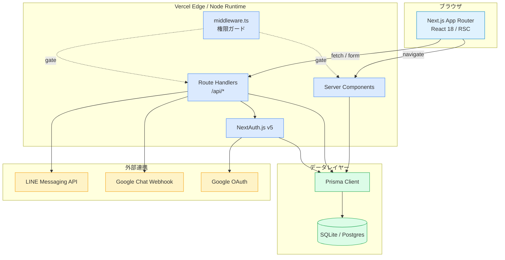
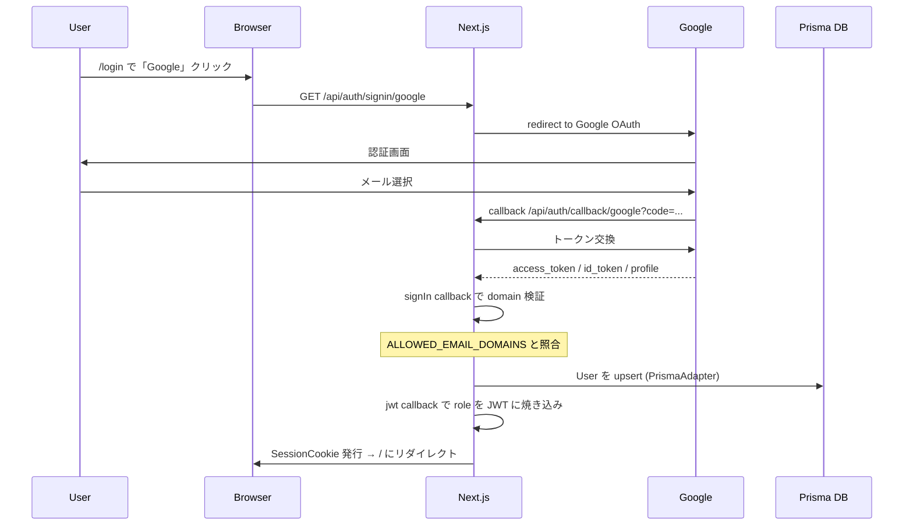
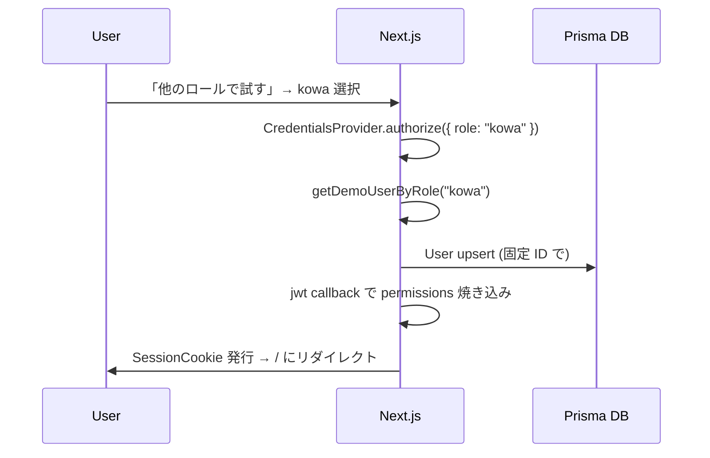
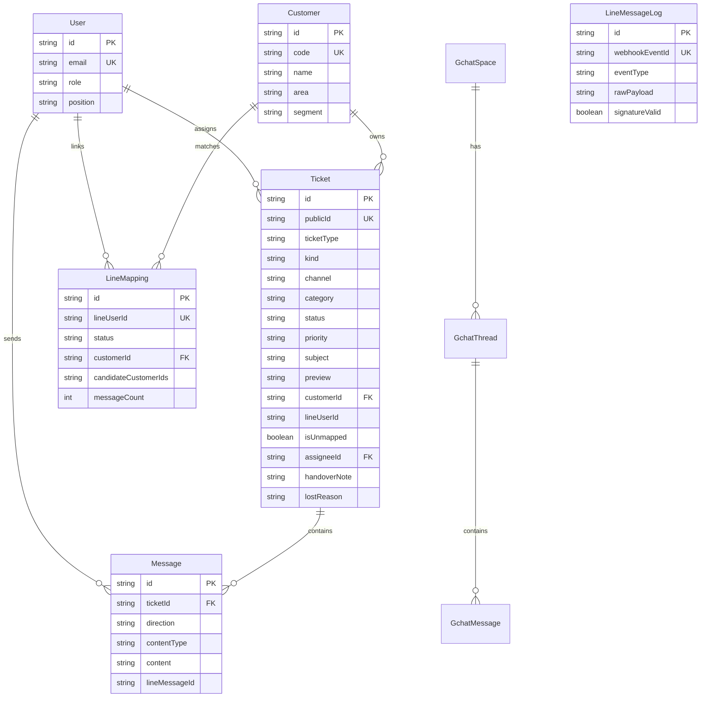

# DEVELOPMENT — リカーショップゴワ LINE問い合わせ進捗管理プラットフォーム 開発者ガイド

> 対象: 本プロジェクトに参加する開発者・コードレビュアー・引き継ぎ担当
> 目的: アーキテクチャ理解 / コーディング規約 / リリースフローの統一

---

## 1. アーキテクチャ概要

### 1.1 全体構成（Phase 1.0 モック / Vercel 単体構成）



### 1.2 本番想定構成（Phase 2.0 GCP移行 - 参考）

詳細は [`integrated-dashboard/integration/LINE_INTEGRATION.md`](../../../integrated-dashboard/integration/LINE_INTEGRATION.md) 参照。
本リポジトリは **モック・MVP** なので Vercel 単体構成を採用。

| レイヤ | Phase 1.0（現行） | Phase 2.0（将来） |
|---|---|---|
| ホスティング | Vercel | Cloud Run |
| DB | SQLite/Postgres | Firestore |
| 非同期処理 | （なし） | Pub/Sub |
| バイナリ保管 | （なし） | Cloud Storage |
| 認証 | NextAuth + Google OAuth | Workspace SSO + IAP |

---

## 2. ディレクトリ構成

```
app/
├── docs/                    # 本ドキュメント類
│   ├── SETUP.md
│   ├── USAGE.md
│   ├── DEVELOPMENT.md       # ← 本ファイル
│   └── API.md
├── prisma/
│   ├── schema.prisma        # データモデル定義
│   ├── seed.ts              # シードデータ（顧客・チケット・マッピング）
│   └── dev.db               # SQLite（gitignore）
├── src/
│   ├── app/                 # Next.js App Router
│   │   ├── api/             # Route Handlers
│   │   │   ├── auth/[...nextauth]/route.ts
│   │   │   ├── webhook/line/route.ts
│   │   │   ├── webhook/gchat/route.ts
│   │   │   ├── tickets/...
│   │   │   ├── mappings/...
│   │   │   └── messages/send/route.ts
│   │   ├── layout.tsx       # ルートレイアウト
│   │   ├── page.tsx         # ダッシュボード（/）
│   │   ├── login/           # /login
│   │   ├── kanban/          # /kanban
│   │   ├── tickets/         # /tickets, /tickets/[id]
│   │   ├── chat/            # /chat
│   │   ├── mappings/        # /mappings
│   │   ├── settings/        # /settings (admin only)
│   │   └── globals.css
│   ├── components/          # UIコンポーネント
│   │   ├── ui/              # shadcn風（Button, Card, Dialog...）
│   │   ├── layout/          # Topbar, Sidebar, AppShell
│   │   ├── auth/            # SignInForm, DemoBanner
│   │   ├── dashboard/       # KpiCards, CategoryChart
│   │   ├── kanban/          # KanbanBoard, KanbanColumn
│   │   ├── tickets/         # TicketTable, TicketDetail
│   │   ├── chat/            # ChatList, MessageThread
│   │   ├── mappings/        # MappingTable, AISuggestCard
│   │   ├── providers.tsx    # QueryClientProvider, SessionProvider
│   │   └── theme-provider.tsx
│   ├── lib/                 # ユーティリティ
│   │   ├── auth.ts          # NextAuth 設定
│   │   ├── prisma.ts        # PrismaClient シングルトン
│   │   ├── queries.ts       # サーバ側DBクエリ
│   │   ├── line.ts          # LINE Messaging API ラッパー
│   │   ├── gchat.ts         # Google Chat Webhook 送信
│   │   ├── demo-users.ts    # デモロール定義
│   │   ├── constants.ts     # ロール・カテゴリ・ステータス定義
│   │   └── utils.ts         # cn(), formatDate() など
│   ├── types/               # 型定義
│   └── middleware.ts        # 認証 / 権限ガード
├── tests/                   # Playwright E2E
├── .env.example
├── .env.local               # 環境変数（gitignore）
├── next.config.js
├── tailwind.config.ts
├── tsconfig.json
├── playwright.config.ts
├── package.json
└── pnpm-lock.yaml
```

---

## 3. 技術スタック詳細

| カテゴリ | 技術 | バージョン | 役割 |
|---|---|---|---|
| ランタイム | Node.js | 20 LTS | サーバ実行環境 |
| パッケージマネージャ | pnpm | 9.x | 依存解決 |
| フレームワーク | Next.js | 14.2.18 | App Router / RSC |
| 言語 | TypeScript | 5.6.3 | 型安全 |
| UI | React | 18.3 | コンポーネント |
| 認証 | NextAuth.js | 5.0.0-beta.25 | OAuth + JWT |
| ORM | Prisma | 5.22 | DB抽象化 |
| DB | SQLite / Postgres | - | 永続化 |
| スタイル | Tailwind CSS | 3.4 | ユーティリティCSS |
| UIプリミティブ | Radix UI | 1.x | アクセシブル基盤 |
| アイコン | lucide-react | 0.460 | SVGアイコン |
| 状態管理 | Tanstack Query | 5.59 | サーバ状態 |
| バリデーション | Zod | 3.23 | スキーマ定義 |
| ドラッグ&ドロップ | @dnd-kit/core | 6.1 | カンバン |
| 日付 | date-fns | 4.1 | フォーマット |
| E2E | Playwright | 1.49 | テスト |

---

## 4. 主要ライブラリの使い方

### 4.1 Next.js App Router

#### Server Component と Client Component の使い分け

| 種別 | 用途 | 例 |
|---|---|---|
| Server Component | データ取得・初期描画 | ダッシュボード、チケット一覧 |
| Client Component | インタラクション・状態保持 | カンバン D&D、フォーム |

**判断基準:**
- DB直接アクセスが必要 → Server
- `useState` / `useEffect` / イベントハンドラ → Client (`"use client"` 宣言)

```typescript
// Server Component（デフォルト）
import { getTickets } from "@/lib/queries";
export default async function TicketsPage() {
  const tickets = await getTickets({ status: "open" });
  return <TicketTable tickets={tickets} />;
}

// Client Component
"use client";
import { useState } from "react";
export function FilterBar() {
  const [keyword, setKeyword] = useState("");
  return <input value={keyword} onChange={(e) => setKeyword(e.target.value)} />;
}
```

#### Route Handlers

```typescript
// src/app/api/tickets/route.ts
import { NextRequest, NextResponse } from "next/server";
import { auth } from "@/lib/auth";
import { db } from "@/lib/prisma";
import { z } from "zod";

const CreateTicketSchema = z.object({
  subject: z.string().min(1).max(120),
  category: z.enum(["inquiry", "order", "delivery", "billing", "claim", "other"]),
});

export async function POST(req: NextRequest) {
  const session = await auth();
  if (!session) return NextResponse.json({ error: "Unauthorized" }, { status: 401 });

  const json = await req.json();
  const body = CreateTicketSchema.parse(json);

  const ticket = await db.ticket.create({ data: { ...body, /* ... */ } });
  return NextResponse.json(ticket, { status: 201 });
}
```

### 4.2 NextAuth.js v5

設定は `src/lib/auth.ts`。Provider は **Google** + **Demo Credentials**。

```typescript
// 使用例: Server Component で session 取得
import { auth } from "@/lib/auth";
const session = await auth();
const userId = session?.user?.id;
const role = (session?.user as any)?.role;
```

```typescript
// Client Component
"use client";
import { useSession } from "next-auth/react";
export function UserBadge() {
  const { data: session } = useSession();
  return <div>{session?.user?.name}</div>;
}
```

### 4.3 Prisma

```typescript
// src/lib/prisma.ts (シングルトン)
import { PrismaClient } from "@prisma/client";
const globalForPrisma = globalThis as unknown as { prisma: PrismaClient };
export const db = globalForPrisma.prisma ?? new PrismaClient();
if (process.env.NODE_ENV !== "production") globalForPrisma.prisma = db;
```

```typescript
// 使用例
const tickets = await db.ticket.findMany({
  where: { status: "open", assigneeId: userId },
  include: { customer: true, assignee: true, messages: { take: 1, orderBy: { sentAt: "desc" } } },
  orderBy: { createdAt: "desc" },
});
```

### 4.4 Tailwind + shadcn風UI

`src/components/ui/` に最小実装:

```typescript
// src/components/ui/button.tsx (例)
import { cva, type VariantProps } from "class-variance-authority";
import { cn } from "@/lib/utils";

const buttonVariants = cva("inline-flex items-center justify-center rounded-md text-sm font-medium", {
  variants: {
    variant: { default: "bg-primary text-white", outline: "border border-input bg-transparent" },
    size: { sm: "h-8 px-3", default: "h-10 px-4", lg: "h-12 px-6" },
  },
  defaultVariants: { variant: "default", size: "default" },
});

export interface ButtonProps extends React.ButtonHTMLAttributes<HTMLButtonElement>, VariantProps<typeof buttonVariants> {}
export function Button({ className, variant, size, ...props }: ButtonProps) {
  return <button className={cn(buttonVariants({ variant, size }), className)} {...props} />;
}
```

### 4.5 Tanstack Query

```typescript
// src/components/providers.tsx
"use client";
import { QueryClient, QueryClientProvider } from "@tanstack/react-query";
const queryClient = new QueryClient({ defaultOptions: { queries: { staleTime: 30_000 } } });

export function Providers({ children }: { children: React.ReactNode }) {
  return <QueryClientProvider client={queryClient}>{children}</QueryClientProvider>;
}
```

```typescript
// 使用例: Client Component
"use client";
import { useQuery, useMutation, useQueryClient } from "@tanstack/react-query";

export function TicketStatusButton({ id, status }: { id: string; status: string }) {
  const qc = useQueryClient();
  const { mutate, isPending } = useMutation({
    mutationFn: async (next: string) => {
      const res = await fetch(`/api/tickets/${id}/status`, {
        method: "PATCH",
        body: JSON.stringify({ status: next }),
      });
      if (!res.ok) throw new Error("Failed");
      return res.json();
    },
    onSuccess: () => qc.invalidateQueries({ queryKey: ["tickets"] }),
  });
  return <Button onClick={() => mutate("answered")} disabled={isPending}>回答済にする</Button>;
}
```

### 4.6 Zod

```typescript
import { z } from "zod";

export const TicketStatusSchema = z.enum([
  "open", "triaging", "internal_check", "supplier_quote",
  "awaiting_reply", "answered", "closed_won", "closed_lost", "escalated",
]);

export const PatchStatusBody = z.object({
  status: TicketStatusSchema,
  comment: z.string().max(500).optional(),
});

export type PatchStatusInput = z.infer<typeof PatchStatusBody>;
```

### 4.7 @dnd-kit/core（カンバン D&D）

```typescript
"use client";
import { DndContext, DragEndEvent } from "@dnd-kit/core";

export function KanbanBoard({ tickets }) {
  function handleDragEnd(e: DragEndEvent) {
    const ticketId = e.active.id as string;
    const newStatus = e.over?.id as string;
    if (!newStatus) return;
    fetch(`/api/tickets/${ticketId}/status`, {
      method: "PATCH",
      body: JSON.stringify({ status: newStatus }),
    });
  }
  return (
    <DndContext onDragEnd={handleDragEnd}>
      {/* Columns */}
    </DndContext>
  );
}
```

### 4.8 Playwright

```typescript
// tests/login.spec.ts
import { test, expect } from "@playwright/test";

test("デモログインでダッシュボードに遷移", async ({ page }) => {
  await page.goto("/login");
  await page.getByRole("button", { name: "後和専務として入る" }).click();
  await expect(page).toHaveURL("/");
  await expect(page.getByText("ダッシュボード")).toBeVisible();
});
```

実行:

```bash
pnpm test:e2e
```

---

## 5. 認証フロー

### 5.1 Google OAuth フロー



### 5.2 デモ Credentials フロー



### 5.3 middleware.ts による権限ガード

```typescript
// src/middleware.ts (要約)
const PUBLIC_PATHS = ["/login", "/api/auth", "/api/webhook", "/_next", "/favicon"];
const ADMIN_ONLY = ["/settings"];
const ADMIN_ROLES = new Set(["kowa", "finance", "manager"]);

export default auth((req) => {
  const { pathname } = req.nextUrl;
  if (PUBLIC_PATHS.some(p => pathname.startsWith(p))) return NextResponse.next();
  if (!req.auth) return NextResponse.redirect("/login?from=" + pathname);
  if (ADMIN_ONLY.some(p => pathname.startsWith(p))) {
    const role = (req.auth.user as any)?.role;
    if (!ADMIN_ROLES.has(role)) return NextResponse.redirect("/?denied=" + pathname);
  }
  return NextResponse.next();
});
```

---

## 6. DBスキーマ詳細

### 6.1 ER図



### 6.2 主要モデル詳細

| モデル | 主キー | ユニーク | インデックス | 備考 |
|---|---|---|---|---|
| User | id (cuid) | email | - | NextAuth標準 |
| Customer | id (cuid) | code | - | BPS連携想定 |
| Ticket | id (cuid) | publicId (TKT-XXXX) | status, assigneeId, lineUserId, customerId | 業務管理基盤の核 |
| Message | id (cuid) | - | ticketId, sentAt | 添付は attachmentUrl |
| LineMapping | id (cuid) | lineUserId | status | FSM管理 |
| LineMessageLog | id (cuid) | webhookEventId | receivedAt, eventType | Webhook監査 |

### 6.3 ステータスFSM

[`SPEC.md`](../../specs/SPEC.md#52-8段階ステータスfsm) v0.3 5.2章を参照。9状態 × 遷移マトリクス。

---

## 7. API設計原則

| 原則 | 内容 |
|---|---|
| RESTful | `GET /api/tickets`, `POST /api/tickets`, `PATCH /api/tickets/{id}` |
| Zod 検証 | 全エンドポイントで入力 schema を Zod 定義 |
| 認証必須 | `auth()` で session 取得、無ければ 401 |
| 権限チェック | role / permission を session から取得して判定 |
| エラーレスポンス | `{ error: string, code?: string, details?: any }` |
| ステータスコード | 200/201/204/400/401/403/404/409/422/500 を明確に |
| Idempotency | webhookEventId 等で冪等化 |

詳細は [`API.md`](./API.md) を参照。

---

## 8. 状態管理パターン

| シナリオ | 採用 |
|---|---|
| サーバ状態（DB由来） | Tanstack Query |
| ローカルUI状態 | useState / useReducer |
| グローバルUI状態 | Context（最小限） |
| URL状態 | useSearchParams / 動的ルート |
| フォーム | React Hook Form + Zod（必要時） |

> **Note**: Redux / Zustand は本プロジェクトでは採用しない。Tanstack Query で十分。

---

## 9. コンポーネント設計原則

### 9.1 命名規則

| 種別 | 形式 | 例 |
|---|---|---|
| コンポーネント | PascalCase | `TicketCard`, `KanbanColumn` |
| props 型 | `<Component>Props` | `TicketCardProps` |
| hook | `use<Name>` | `useTicketStatus` |
| ユーティリティ | camelCase | `formatDate`, `cn` |
| 定数 | UPPER_SNAKE | `TICKET_STATUSES`, `ROLES` |

### 9.2 ファイル配置

| 種別 | 配置 |
|---|---|
| ページ | `src/app/<route>/page.tsx` |
| ページ用 layout | `src/app/<route>/layout.tsx` |
| 再利用UI | `src/components/ui/` |
| ドメインUI | `src/components/<domain>/` |
| 単一ページ専用 | ページと同階層に配置可 |

### 9.3 データ取得パターン

```typescript
// NG: Server Component で自分の API を fetch する
export default async function Page() {
  const res = await fetch("/api/tickets");  // 自前APIを叩くのは無駄
  const tickets = await res.json();
  return <TicketTable tickets={tickets} />;
}

// OK: Server Component から直接 Prisma
import { db } from "@/lib/prisma";
export default async function Page() {
  const tickets = await db.ticket.findMany({ /* ... */ });
  return <TicketTable tickets={tickets} />;
}

// OK: Client Component から useQuery
"use client";
import { useQuery } from "@tanstack/react-query";
export function LiveBoard() {
  const { data } = useQuery({
    queryKey: ["tickets"],
    queryFn: () => fetch("/api/tickets").then(r => r.json()),
  });
  return <KanbanBoard tickets={data ?? []} />;
}
```

---

## 10. スタイルガイド

### 10.1 色パレット（Tailwind 拡張）

`tailwind.config.ts` で定義。基本は `slate` ベース + アクセント。

| 用途 | クラス例 |
|---|---|
| ブランドカラー | `bg-primary text-primary-foreground` |
| 警告 | `bg-amber-100 text-amber-900` |
| エラー | `bg-red-100 text-red-900` |
| 成功 | `bg-emerald-100 text-emerald-900` |
| 情報 | `bg-blue-100 text-blue-900` |

### 10.2 ステータスバッジ色対応

| ステータス | 色 |
|---|---|
| open | slate |
| triaging | blue |
| internal_check | indigo |
| supplier_quote | purple |
| awaiting_reply | amber |
| answered | emerald |
| closed_won | green |
| closed_lost | red |
| escalated | rose |

`src/lib/constants.ts` の `STATUS_STYLES` から取得。

### 10.3 余白・サイズ

- 縦間隔: `space-y-{2,4,6,8}`（コンテナの粒度に応じて）
- カード内 padding: `p-4` 〜 `p-6`
- 角丸: `rounded-md`（小要素） / `rounded-lg`（カード）

---

## 11. テスト戦略

### 11.1 テストピラミッド

```
        /\
       /E2E\        Playwright（重要シナリオのみ 5〜10本）
      /────\
     /統合 \       Route Handler のテスト（必要に応じて）
    /──────\
   / Unit   \     ユーティリティ関数のテスト（vitest 想定）
  /──────────\
```

### 11.2 E2E カバー対象

| シナリオ | 必須度 |
|---|---|
| デモログイン → ダッシュボード表示 | 必須 |
| カンバンで D&D してステータス変更 | 必須 |
| 未紐付け一覧 → AIサジェスト → 紐付け | 高 |
| 担当者変更（メモ必須） | 高 |
| Webhook受信 → チケット作成 | 高 |
| 設定画面のロール制限 | 中 |

### 11.3 実行

```bash
pnpm test:e2e            # ヘッドレス
pnpm test:e2e --ui       # UI モード
pnpm test:e2e --debug    # ステップ実行
```

---

## 12. CI/CD（GitHub Actions 想定）

`.github/workflows/ci.yml`（参考）:

```yaml
name: CI
on: [push, pull_request]
jobs:
  test:
    runs-on: ubuntu-latest
    steps:
      - uses: actions/checkout@v4
      - uses: pnpm/action-setup@v3
        with: { version: 9 }
      - uses: actions/setup-node@v4
        with: { node-version: 20, cache: pnpm }
      - run: pnpm install --frozen-lockfile
      - run: pnpm typecheck
      - run: pnpm lint
      - run: pnpm test:e2e
```

---

## 13. Vercel deploy 手順

### 13.1 初回セットアップ

```bash
npm i -g vercel
cd app
vercel link
```

### 13.2 環境変数登録

```bash
vercel env add AUTH_SECRET production
vercel env add AUTH_GOOGLE_ID production
vercel env add AUTH_GOOGLE_SECRET production
vercel env add NEXTAUTH_URL production
vercel env add DATABASE_URL production
vercel env add LINE_CHANNEL_ID production
vercel env add LINE_CHANNEL_SECRET production
vercel env add LINE_CHANNEL_ACCESS_TOKEN production
vercel env add GCHAT_WEBHOOK_URL production
vercel env add ALLOWED_EMAIL_DOMAINS production
vercel env add DEMO_MODE production       # デモなら true / 本番 false
vercel env add NEXT_PUBLIC_DEMO_MODE production
```

### 13.3 デプロイ

```bash
vercel --prod
```

`package.json` の `vercel-build` スクリプトが以下を実行:

1. `prisma generate`
2. `prisma db push --accept-data-loss --skip-generate`
3. `tsx prisma/seed.ts`
4. `next build`

### 13.4 ドメイン設定

Vercel Dashboard > Settings > Domains で `gowa-line-mgr.gowa58.co.jp` などを設定。

---

## 14. リリースフロー

### 14.1 ブランチ戦略

| ブランチ | 用途 |
|---|---|
| `main` | 本番デプロイ対象（保護ブランチ） |
| `develop` | 統合開発ブランチ |
| `feature/<name>` | 機能開発 |
| `fix/<name>` | バグ修正 |
| `release/v<x.y.z>` | リリース準備 |

### 14.2 バージョニング（SemVer）

| 種別 | 例 | タイミング |
|---|---|---|
| MAJOR | 1.x → 2.0 | 破壊的変更（DB schema 大改修等） |
| MINOR | 1.0 → 1.1 | 新機能追加 |
| PATCH | 1.0.0 → 1.0.1 | バグ修正 |

`package.json` の `version` を更新 → タグ作成 → main にマージ → Vercel 自動デプロイ。

### 14.3 リリースチェックリスト

- [ ] CHANGELOG.md 更新
- [ ] バージョン番号更新
- [ ] 環境変数の追加・変更を README/.env.example に反映
- [ ] Prisma スキーマ変更があれば migration を確認
- [ ] E2E パス
- [ ] PR レビュー完了
- [ ] main マージ → Vercel 自動デプロイ
- [ ] 本番動作確認
- [ ] お客様への変更通知（Google Chat）

---

## 15. セキュリティガイドライン

### 15.1 シークレット管理

| 項目 | OK | NG |
|---|---|---|
| `.env.local` | Gitignoreで除外 | コミット |
| Vercel 環境変数 | Dashboard で登録 | コードにハードコード |
| LINE_CHANNEL_SECRET | Secret Manager 級 | Slack/Chat に貼る |

### 15.2 LINE Webhook 署名検証

```typescript
// src/lib/line.ts
import crypto from "node:crypto";

export function verifyLineSignature(rawBody: Buffer, signature: string, secret: string): boolean {
  const computed = crypto.createHmac("sha256", secret).update(rawBody).digest("base64");
  const a = Buffer.from(computed);
  const b = Buffer.from(signature);
  if (a.length !== b.length) return false;
  return crypto.timingSafeEqual(a, b);
}
```

> **Warning**: `DEMO_MODE=true` の間は署名検証をスキップする。本番では絶対に false にすること。

### 15.3 SQL Injection / XSS

- Prisma の Parameterized Query を必ず使う（生SQL禁止）
- React は自動 escape されるため、生 HTML 注入系の API は使わない方針
- ユーザー入力は Zod で validate してから DB へ

### 15.4 CSRF

NextAuth.js が CSRF token を自動付与。Route Handler でも `auth()` を必ず呼ぶこと。

### 15.5 RBAC

- middleware.ts で粗いガード
- Route Handler 内で細かい権限チェック
- DB クエリで `assigneeId === userId` の絞り込み（特に `staff_field`）

### 15.6 監査ログ

| 操作 | ログ先 |
|---|---|
| 担当者変更 | `Ticket.handoverNote` + Vercel Logs |
| ステータス変更 | Vercel Logs |
| Webhook受信 | `LineMessageLog` |
| 認証失敗 | NextAuth.js logger |

---

## 16. 開発時のよくある落とし穴

| # | 症状 | 原因 | 対処 |
|---|---|---|---|
| 1 | Server Component で `useState` エラー | `"use client"` 漏れ | ファイル冒頭に `"use client"` 追加 |
| 2 | Webhook が DB に届かない | rawBody を JSON parse してから署名検証 | rawBody を Buffer のまま検証 → parse |
| 3 | デモロール切替が反映されない | JWT に焼き込まれた role が古い | `signOut()` → 再ログイン |
| 4 | Prisma で `Cannot read properties of undefined` | `node_modules` 不整合 | `pnpm install --force && pnpm db:generate` |
| 5 | ngrok URL が変わって LINE が届かない | 無料版は再起動毎に変わる | cloudflared の固定ドメイン使用 |
| 6 | Vercel deploy で `Permission denied` | DATABASE_URL が prod に登録されていない | `vercel env add` で登録 |
| 7 | Tailwind class が効かない | `tailwind.config.ts` の content path 設定漏れ | `./src/**/*.{ts,tsx}` を含める |
| 8 | E2E が flaky | 待機が暗黙的 | `await expect(...).toBeVisible()` で明示的に |

---

## 17. 関連ドキュメント

- 製品仕様: [`../../specs/SPEC.md`](../../specs/SPEC.md) v0.3
- LINE連携設計: [`../../../integrated-dashboard/integration/LINE_INTEGRATION.md`](../../../integrated-dashboard/integration/LINE_INTEGRATION.md)
- セットアップ: [`./SETUP.md`](./SETUP.md)
- API仕様: [`./API.md`](./API.md)
- お客様向けガイド: [`./USAGE.md`](./USAGE.md)

---

> 株式会社デジライズ 2026年5月版
> 本ガイドは仕様変更・知見蓄積に応じて随時更新します。
